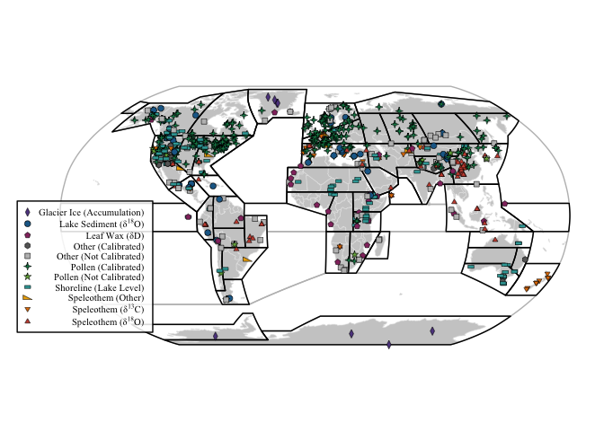
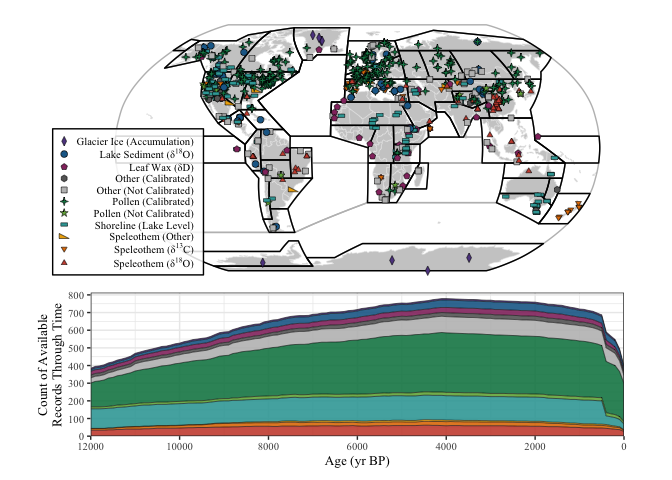

Figure 1 & Table 1 - Holocene Hydroclimate Proxy Summary
================
Chris Hancock

#### Load Packages

``` r
library(cowplot)
library(egg)
library(geoChronR)
```

    ## Welcome to geoChronR version 1.1.9!

``` r
library(ggrepel)
library(ggplot2)
library(ggstar)
library(lipdR)
library(maptools)
library(proj4)
library(RColorBrewer)
library(rworldmap)
library(scales)
library(sp)
library(tidyverse)

print("Packages Loaded")
```

    ## [1] "Packages Loaded"

#### Load Data

``` r
var     <- 'HC'
lipdTSO <- readRDS(file.path(wd,'Data','Proxy','lipdData.rds'))[[var]]
proxyDf <- read.csv(file=file.path(wd,'Data','Proxy',paste0('proxyMetaData_',var,'.csv')))
print("Proxy data loaded ")
```

    ## [1] "Proxy data loaded "

``` r
#Load IPCC region data
load(url('https://github.com/SantanderMetGroup/ATLAS/blob/main/reference-regions/IPCC-WGI-reference-regions-v4_R.rda?raw=true'), verbose = TRUE)
```

    ## Loading objects:
    ##   IPCC_WGI_reference_regions_v4

#### Figure Settings

``` r
save     <- TRUE
specific <- TRUE 

if (save){ print(paste0("save ",var," figs"))
} else{    print(paste0("plot ",var," figs"))}
```

    ## [1] "save HC figs"

``` r
figFont <- 'Times New Roman'
figText <- 10
figSize <- c(6.5,3)
```

#### Summary Table (Table 1)

``` r
#Summarize metadata by category
pivot <- proxyDf %>%
  group_by(CategorySpec) %>%
  dplyr::summarize(count =  n(),
            ageRange     = median(ageRange),
            ageRes       = median(ageRes),
            ageCtrlN     = median(ageCtrlN,na.rm=TRUE),
            ageCtrlMax   = median(ageCtrlMax,na.rm=TRUE),
            pctChronData = NA)

#Manually change rows to desired order
pivot <- pivot[c(1,2,3,6,7,8,11,10,9,4,5),]

#Add "All" row
pivot[12,] <- proxyDf %>%
  dplyr::summarize(CategorySpec='All', count =  n(),
            ageRange     = median(ageRange),
            ageRes       = median(ageRes),
            ageCtrlN     = median(ageCtrlN,na.rm=TRUE),
            ageCtrlMax   = median(ageCtrlMax,na.rm=TRUE),
            pctChronData = NA)

#Calc % of records with age control
summary <- proxyDf[which(!is.na(proxyDf$ageCtrlMax)),]
summary <- summary[which(summary$archive %in% c('Wood','GlacierIce') == FALSE),]
summary <- summary[which(summary$Category != 'Shoreline'),]
diff    <- as.character(round(100*(length(which(proxyDf$archive %in% c('Wood','GlacierIce')) 
                                  + which(proxyDf$Category == 'Shoreline')))/nrow(proxyDf)))
pivot[12,'pctChronData'] <- as.character(round(100*nrow(summary)/nrow(proxyDf)))
pivot[12,'pctChronData'] <- paste0(pivot[12,'pctChronData'],'+',diff)
summary <- summary %>% group_by(CategorySpec) %>% dplyr::summarize(count =  n())

for (cat in summary$CategorySpec){
  n   = summary[which(summary$CategorySpec==cat),2]
  pct = 100*n/pivot[which(pivot$CategorySpec==cat),'count']
  pivot[which(pivot$CategorySpec==cat),'pctChronData'] <- as.character(round(pct))
}

pivot
```

    ## # A tibble: 12 × 7
    ##    CategorySpec               count ageRange ageRes ageCtrlN ageCtrlMax pctChr…¹
    ##    <chr>                      <int>    <dbl>  <dbl>    <dbl>      <dbl> <chr>   
    ##  1 Glacier Ice (Accumulation)     8   12000    19.4     NA          NA  <NA>    
    ##  2 Lake Sediment (δ18O)          43    9285    31        9        2070  79      
    ##  3 Leaf Wax (δD)                 31   11013   150       11        2345  74      
    ##  4 Pollen (Calibrated)          345   10820   150        7        2500  94      
    ##  5 Pollen (Not Calibrated)       19   11840    86.5     12.5      2395  74      
    ##  6 Shoreline (Lake Level)       139   11506. 1174.      10        2145  <NA>    
    ##  7 Speleothem (δ18O)             74    8895.   12.2     15        1476. 89      
    ##  8 Speleothem (δ13C)             28    7684.   25.9     10        1630. 100     
    ##  9 Speleothem (Other)             9    8163.   34       14        1184. 67      
    ## 10 Other (Calibrated)            23   10000   106.      18        1326  4       
    ## 11 Other (Not Calibrated)        94    9542.   37.8      9        2214. 62      
    ## 12 All                          813   10820   109.       8.5      2348. 68+17   
    ## # … with abbreviated variable name ¹​pctChronData

#### Plot sample resolution histogram (only Holocene ages)

``` r
#Summarize dataframe by source
pieData    <- proxyDf %>% 
  group_by(source) %>% 
  dplyr::summarize(count =  n())

#Change names to be more descriptive
names <- as.character(pieData$source)
i <-  which(names=='Arctic Holocene')
names[i] <- paste0('Arctic Holocene (Sundqvist et al., 2014)',
                   ' (n=',as.character(pieData$count[i]),')')
i <-  which(names=='Iso2k')
names[i] <- paste0('Iso2k (Konecky et al., 2020)',
                   ' (n=',as.character(pieData$count[i]),')')
i <-  which(names=='Other')
names[i] <- paste0('Miscellaneous',
                   ' (n=',as.character(pieData$count[i]),')')
i <-  which(names=='SISALv2')
names[i] <- paste0('SISALv2 (Comas-Bru et al., 2020)',
                   ' (n=',as.character(pieData$count[i]),')')
i <-  which(names=='Oxford Lake Level Database')
names[i] <- paste0('Oxford Lake Level Database (Street-Perrott et al., 1989)',
                   ' (n=',as.character(pieData$count[i]),')')
i <-  which(names=='Liefert and Shuman, 2020 ')
names[i] <- paste0('N.A. Lake Level Database (Liefert and Shuman, 2020)',
                   ' (n=',as.character(pieData$count[i]),')')
i <-  which(names=='Legacy Climate v1.0')
names[i] <- paste0('Legacy Climate v1.0 (Herzschuh et al., 2022)',
                   ' (n=',as.character(pieData$count[i]),')')
i <-  which(names=='Mid-Latitude Holocene')
names[i] <- paste0('Mid-Latitude Holocene (Routson et al., 2019)',
                   ' (n=',as.character(pieData$count[i]),')')
i <-  which(names=='wNA')
names[i] <- paste0('Western North America (Routson et al., 2021)',
                   ' (n=',as.character(pieData$count[i]),')')
pieData$source <- names

#Arrange in alphabetical order 
pieData <- pieData %>% arrange(source)
#Cumulative sum to id where to plot on graph
pieData$pos <- cumsum(pieData$count)

#Plot pie chart for source
pie <- ggplot(pieData,aes(x="", y=count, fill=source)) +
  geom_bar(stat="identity", width=1, color= 'black') +
  coord_polar("y", start=0) +
  scale_fill_manual(values=c("powder blue","dark blue","forest green","royal blue","yellowgreen",
                             "grey","corn flower blue","firebrick","orange"),name='Data Source') +
  theme_void() + 
  theme(text = element_text(family=figFont,size=figText),
        plot.background = element_rect(fill = 'white',color='Black'),
        plot.margin = unit(c(0.1, 0.1, 0.1, 0.1), "in"),
        legend.key.height = unit(0.15, "in"),
        legend.key.width = unit(0.15, "in"))
        #legend.title = element_blank())#,legend.position = 'none')# legend.position = c(0.5,0.7))
if (save) {
  ggsave(plot=pie , width = figSize[1], height = figSize[2], units='in', dpi = 600,
       filename = file.path(wd,"Figures","Proxy","PlotProxySource.png"))
}
print("Summary of data source for proxy data")
```

    ## [1] "Summary of data source for proxy data"

``` r
pie
```

<!-- -->

#### Plot sample resolution histogram (only Holocene ages)

``` r
plotData <- proxyDf[,'ageRes']
binsize <- 30

plotRes <- basePlot+
  geom_vline( xintercept=median(plotData), size=0.8) +
  #geom_vline(xintercept=mean(  plotData), size=0.8, linetype=2) +
  geom_histogram(aes(plotData, fill=CategorySpec), color='Black', alpha=0.7, 
                 breaks = c(0,binsize/2,seq(binsize,max(plotData,na.rm=TRUE)+binsize,binsize))) +
  scale_fill_manual(values=plotSettings$color) +
  scale_x_continuous(name=paste0("Median Proxy Sample Resolution (binwidth = ",binsize," years)") ,
                     limits=c(0,max(plotData,na.rm=TRUE)+binsize/2), expand=c(0,0),
                  breaks=seq(0,max( plotData,na.rm=TRUE),300)) +
  scale_y_continuous(name="Count of Records", oob=scales::squish, limits=c(0,150), expand=c(0,0))+
  theme(legend.position = c(0.8,0.5))

if (save) {
  ggsave(plot=plotRes, width = figSize[1], height = figSize[2], units='in', dpi = 600,
         filename = file.path(wd,"Figures","Proxy","PlotProxyAgeRes.png"))
}
print(paste("Mean:",as.character(round(mean(plotData)))))
```

    ## [1] "Mean: 230"

``` r
print(paste("Median:",as.character(round(median(plotData)))))
```

    ## [1] "Median: 109"

``` r
print(paste("Range:",as.character(round(range(plotData)))))
```

    ## [1] "Range: 0"    "Range: 1174"

``` r
plotRes
```

<!-- -->

#### Plot record length histogram (only Holocene ages)

``` r
plotData <- proxyDf[,'ageRange']
binsize <- 500

plotRange <- basePlot+
  geom_vline( xintercept=median(plotData), size=0.8) +
  #geom_vline(xintercept=mean(  plotData), size=0.8, linetype=2) +
  geom_histogram(aes(plotData, fill=CategorySpec), color='Black', alpha=0.7, 
                 breaks = c(0,seq(binsize,max(proxyDf[,'ageRange'],na.rm=TRUE)+binsize,binsize))) +
  scale_fill_manual(values=plotSettings$color) +
  scale_x_continuous(name = paste("Record Length (binwidth =",binsize,"years)"),
                     limits=c(4000,12000),expand=c(0,0),breaks=seq(3000,12000,2000)) +
  scale_y_continuous(name="Count of Records", oob=scales::squish, limits=c(0,350), expand=c(0,0))+
  theme(legend.position = c(0.2,0.5))
  
if (save) {
  ggsave(plot=plotRange, width = figSize[1], height = figSize[2], units='in', dpi = 600,
         filename = file.path(wd,"Figures","Proxy","PlotProxyAgeRange.png"))
}
print(paste("Mean:",as.character(round(mean(plotData)))))
```

    ## [1] "Mean: 9608"

``` r
print(paste("Median:",as.character(round(median(plotData)))))
```

    ## [1] "Median: 10820"

``` r
print(paste("Range:",as.character(round(range(plotData)))))
```

    ## [1] "Range: 24"    "Range: 12000"

``` r
plotRange
```

<!-- -->

#### Plot age control histogram (only Holocene ages)

``` r
plotData <- proxyDf[,'ageCtrlMax']
binsize <- 500

plotChron <- basePlot+
  geom_vline( xintercept=median(plotData), size=0.8) +
  #geom_vline(xintercept=mean(  plotData), size=0.8, linetype=2) +
  geom_histogram(aes(plotData, fill=CategorySpec), color='Black', alpha=0.7, 
                 breaks = c(0,seq(binsize,max(proxyDf[,'ageRange'],na.rm=TRUE)+binsize,binsize))) +
  scale_fill_manual(values=plotSettings$color[-c(1)]) +
  scale_x_continuous(name = paste("Maximum Age Control Gap (binwidth =",binsize,"years)"),
                     limits=c(0,6000),expand=c(0,0),breaks=seq(0,6000,1000)) +
  #scale_y_continuous(name="Count of Records", oob=scales::squish, limits=c(0,150), expand=c(0,0))+
  theme(legend.position = c(0.8,0.5))
  
if (save) {
  ggsave(plot=plotChron, width = figSize[1], height = figSize[2], units='in', dpi = 600,
         filename = file.path(wd,"Figures","Proxy","PlotProxyAgeControl.png"))
}
print(paste("Mean:",as.character(round(mean(plotData)))))
```

    ## [1] "Mean: NA"

``` r
print(paste("Median:",as.character(round(median(plotData)))))
```

    ## [1] "Median: NA"

``` r
print(paste("Range:",as.character(round(range(plotData)))))
```

    ## [1] "Range: NA" "Range: NA"

``` r
plotChron
```

<!-- -->

#### Plot time density

``` r
plotTimeData <- plotTimeAvailabilityTs(lipdTSO,age.range = c(0,12000),step=100,group='CategorySpecific')
plotTime <- ggplot(plotTimeData$data,aes(yvec,value))+
  geom_area(alpha=0.9,aes(fill=group),color='Black',size=0.2)+
  scale_fill_manual(values=plotSettings$color) +
  scale_x_reverse(name = "Age (yr BP)", limits=c(12000,0),expand=c(0,0),n.breaks=7)+
  scale_y_continuous(name = "Count of Available\nRecords Through Time",
                     limits=c(0,length(lipdTSO)),expand=c(0,0),
                     labels=seq(0,length(lipdTSO),100), breaks=seq(0,length(lipdTSO),100))+
  theme_bw()+
  theme(text = element_text(family=figFont,size=figText),
        plot.background = element_rect(fill = 'White',color='Black'),
        plot.margin = unit(c(0, 0.1, 0.1, 0.1), "in"),
        legend.key.height = unit(0.1, "in"),
        legend.key.width = unit(0.1, "in"),
        legend.title = element_blank())#,legend.position = 'none')# legend.position = c(0.5,0.7))

if (save) {
  ggsave(plot=plotTime, width = figSize[1], height = figSize[2], units='in', dpi = 600,
         filename = file.path(wd,"Figures","Proxy","PlotTimeAvailability.png"))
}
plotTime
```

<!-- -->

#### Map proxy data

``` r
labs <- plotSettings$names
labs[2]    <- expression(paste("Lake Sediment (δ"^"18"*"O)"))#bquote(atop(Lake~Sediment~δ^18~O))
labs[10]      <- expression(paste("Speleothem (δ"^"13"*"C)"))
labs[11]      <-expression(paste("Speleothem (δ"^"18"*"O)"))

proxyMapSites <- basemap+
  #Proxy Data
  geom_star(data= as.data.frame(proxyDf),aes(x=lonsPrj , y=latsPrj,
                                                  starshape=CategorySpec, fill=CategorySpec),
            size=1.75,color='Black',alpha=1,starstroke=0.3) + 
  scale_fill_manual(values=plotSettings$color,name= 'Proxy Category',labels=labs) +
  scale_starshape_manual(values=plotSettings$shape,name= 'Proxy Category',labels=labs) +
  #Theme
  theme(text = element_text(family=figFont,size=figText),
        plot.background = element_rect(fill = 'white',color='white'),
        plot.margin = unit(c(0.1, 0.1, 0.1, 0.4), "in"),
        legend.background =  element_rect(fill = alpha('white', 0.85),size=0.5),#alpha=0.5),
        legend.margin = margin(c(0, 0.1, 0.05, 0.06), unit="in"),
        legend.key.height = unit(0.12, "in"),
        legend.key.width = unit(0.12, "in"),
        legend.position = c(0.09,0.32),
        legend.title = element_blank())#,legend.position = 'none')# legend.position = c(0.5,0.7))
if (save) {
  ggsave(plot=proxyMapSites, width = 6.5, height = 3.25, dpi = 600, 
       filename = file.path(wd,"Figures","Proxy",paste('PlotProxyTypeRegion_',var,'.png',sep='')))
}


proxyMapSites
```

<!-- -->

#### Combine proxy map with time density plot

``` r
fig1 <- ggarrange(proxyMapSites+ theme(legend.position = c(0.07,0.3)), 
                  plotTime+      theme(legend.position = 'none',
                                       plot.margin = unit(c(0, 0.5, 0.1, 0.4), "in")),
                 ncol=1, widths=c(6.5), heights=c(3.25,1.75), padding=0)
```

<!-- -->

``` r
if (save) {
  ggsave(plot=fig1, width = 6.5, height = 5, dpi = 600,
       filename = file.path(wd,"Figures","Proxy",paste('Figure1_',var,'_ProxyMapwithTime.png',sep='')))
}
```

#### Plot number of records in each region.

``` r
dataTable <- fortify(subset(refregions, Acronym %in% proxyDf$ipccReg))
dataTable$Count     <- NA
dataTable$CountName <- NA
dataTable$Region    <- NA

#Set Breaks and color scheme with lowest group as grey
figBreaks <- c(5,10,15,20,30,50,80)
figlabels <- c(paste("<",figBreaks[1]+1),
               paste(as.character(figBreaks[-length(figBreaks)]+1),"-",as.character(figBreaks[-1])),
               paste(">",figBreaks[length(figBreaks)]))
figPalette <- c("#CCCCCC",RColorBrewer::brewer.pal(n=7, name = "YlOrRd"))

#Count number of records in each region
for (reg in unique(dataTable$id)){
  i     <- which(refregions@data[["Acronym"]]==reg)
  count <- length(which(proxyDf$ipccReg      ==reg))
  if (count == 0){                   countName <- NA
  } else if (count <= figBreaks[1]){ countName <- 0
  } else if (count <= figBreaks[2]){ countName <- 1
  } else if (count <= figBreaks[3]){ countName <- 2
  } else if (count <= figBreaks[4]){ countName <- 3
  } else if (count <= figBreaks[5]){ countName <- 4
  } else if (count <= figBreaks[6]){ countName <- 5
  } else if (count <= figBreaks[7]){ countName <- 6
  } else {countName <- 7}
  dataTable$Count[    which(dataTable$id==reg)] <- count
  dataTable$CountName[which(dataTable$id==reg)] <- countName
  dataTable$Region[   which(dataTable$id==reg)] <- reg
}

#Plot
proxyMapRegions <- basemap + 
  #Add refrence regions boundaries
  geom_map(data=subset(refregions, Acronym %in% proxyDf$ipccReg), 
           map=dataTable, alpha=0.75, size=0.5, color='black' , 
           aes(x=long, y=lat, group=group, map_id=id,fill=as.factor(dataTable$CountName))) +
  scale_fill_manual(values=figPalette,labels=figlabels)+
  #Add proxy sites
  geom_point(data=as.data.frame(proxyDf), aes(x=lonsPrj , y=latsPrj), shape=1,size=0.8) +
  #Format Legend
  theme(plot.background = element_rect(fill = 'white',color='white'),
        plot.margin = unit(c(0.1, 0.1, 0.1, 0.1), "in"),
        legend.position = c(0.5,-0.01),
        legend.direction = "horizontal",
        legend.title=element_blank(),
        legend.background=element_rect(colour='black',size=0.4),
        legend.margin=margin(t = 1, r = 1, b = 3, l = -4.5, unit = "pt"),
        legend.key.width  = (unit(35, 'pt')),
        legend.key.height = (unit(5, 'pt')),
        legend.text = element_text(family='Times New Roman',size=8))

if (save) {
  ggsave(plot=proxyMapRegions, width = 6.5, height = 3.25, dpi = 600,
         filename = file.path(wd,"Figures","Proxy",paste('PlotCountByRegion_',var,'.png',sep='')))
}
proxyMapRegions
```

<!-- -->
