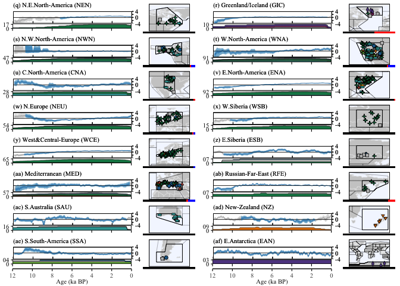

Figures 2 - Holocene Hydroclimate Proxy Composites (grid)
================
Chris Hancock

#### Load Packages

``` r
library(cowplot)
library(egg)
library(geoChronR)
```

    ## Welcome to geoChronR version 1.1.9!

``` r
library(ggrepel)
library(ggplot2)
library(ggstar)
library(lipdR)
library(maptools)
library(proj4)
library(RColorBrewer)
library(rworldmap)
library(scales)
library(sp)
library(tidyverse)

print("Packages Loaded")
```

    ## [1] "Packages Loaded"

#### Load Data

``` r
var      <- 'HC'
modelVar <- 'pre_ANN'

lipdTSO <- readRDS(file.path(wd,'Data','Proxy','lipdData.rds'))[[var]]
proxyDf <- read.csv(file=file.path(wd,'Data','Proxy',paste0('proxyMetaData_',var,'.csv')))
proxyDf <- proxyDf %>% filter(season %in% c("Winter+","Summer+") == FALSE)
print("Proxy data loaded ")
```

    ## [1] "Proxy data loaded "

``` r
#Get x axis 
binvec <- read.csv(file.path(wd,'Data','RegionComposites',var,'MedianTS_byRegion.csv'))$time

#Load IPCC region data
load(url('https://github.com/SantanderMetGroup/ATLAS/blob/main/reference-regions/IPCC-WGI-reference-regions-v4_R.rda?raw=true'), verbose = TRUE)
```

    ## Loading objects:
    ##   IPCC_WGI_reference_regions_v4

``` r
regionData <- vector(mode='list')

for (reg in sort(unique(proxyDf$ipccReg))){
  regionData[[reg]]$polygon   <- IPCC_WGI_reference_regions_v4[IPCC_WGI_reference_regions_v4@data$Acronym == reg, ]
  regionData[[reg]]$name      <- as.character(regionData[[reg]]$polygon$Name)
  regionData[[reg]]$type      <- as.character(regionData[[reg]]$polygon$Type)
  regionData[[reg]]$latitude  <- regionData[[reg]]$polygon@polygons[[1]]@labpt[[1]]
  regionData[[reg]]$longitude <- regionData[[reg]]$polygon@polygons[[1]]@labpt[[2]]
  regionData[[reg]]$LiPD      <- lipdTSO[which(pullTsVariable(lipdTSO,'geo_ipccRegion')==reg)]
  regionData[[reg]]$LiPD      <- regionData[[reg]]$LiPD[which(pullTsVariable(regionData[[reg]]$LiPD,'climateInterpretation1_seasonalityGeneral') %in% c("Winter+","Summer+") == FALSE)]
  regionData[[reg]]$nproxy    <- length(regionData[[reg]]$LiPD)
  regionData[[reg]]$SummaryDF <- proxyDf %>% filter(ipccReg==reg)
  #ID times during region with <50% proxy availability
  regionData[[reg]]$pltTime   <- plotTimeAvailabilityTs(regionData[[reg]]$LiPD,age.range=c(0,12000),
                                                        group.var ='CategorySpecific',step=100)
  limits <- regionData[[reg]]$pltTime$dat %>% group_by(yvec) %>% summarise(pct=round(100*sum(value)/regionData[[reg]]$nproxy,1))
  regionData[[reg]]$Limits50  <- seq(max(0,which(limits$yvec<6000 & limits$pct < 50)+1),
                                     min(nrow(limits),which(limits$yvec>6000 & limits$pct < 50)-1))
  tryCatch(
    expr = {regionData[[reg]]$compEnsemble <- read.csv(file.path(wd,'Data','RegionComposites',var,paste(reg,'.csv',sep='')))},
    error = function(e){regionData[[reg]]$compEnsemble <- NA}
  )
}
```

#### Figure Settings

``` r
save     <- TRUE
specific <- TRUE 

if (save){ print(paste0("save ",var," figs"))
} else{    print(paste0("plot ",var," figs"))}
```

    ## [1] "save HC figs"

``` r
figFont <- 'Times New Roman'
figText <- 10
figSize <- c(6.5,7)
alph    <- 1
```

\####Plot Grid

``` r
page1<- c('WCA','ECA','TIB','EAS','NCA','SAS','SCA','SEA',
          'NWS','SAH','SAM','NEAF','NES','SEAF','WSAF','ESAF')
page2<- c('NEN','GIC','NWN','WNA','CNA','ENA','NEU','WSB',
          'WCE','ESB','MED','RFE','SAU','NZ','SSA','EAN')
for (sample in c(1,2)){
  if (sample == 1){
    regNames <- page1
    position <- c(letters[1:length(page1)])
  } else{
    regNames <- page2
    position <- c(letters[(length(page1)+1):26],paste0('a',letters[1:(length(page1)+length(page2)-26)]))
  }
  #
  regPlts <- vector(mode='list')
  for (reg in regNames){
    #Load Data for Region
    regTso   <- regionData[[reg]]$LiPD
    regionDf <- regionData[[reg]]$SummaryDF
    #Ensemble Composite Values
    regEnsNA <- regionData[[reg]]$compEnsemble
    regEnsNA <- (regEnsNA - as.numeric(apply(regEnsNA,2,mean,na.rm=TRUE)))/as.numeric(apply(regEnsNA,2,sd,na.rm=TRUE))
    #regEnsNA <- (regEnsNA - mean(apply(regEnsNA,1,quantile,probs=c(0.5),na.rm=TRUE),na.rm=TRUE))/sd(apply(regEnsNA,1,quantile,probs=c(0.5),na.rm=TRUE),na.rm=TRUE)
    #Create matrix for portion of timeseries with >50% data coverage
    regEns  <- matrix(NA,nrow(regEnsNA),ncol(regEnsNA))
    regEns[regionData[[reg]]$Limits50,] <- as.matrix(regEnsNA[regionData[[reg]]$Limits50 ,])
    #Set up plot
    plotlim <- min(seq(2,8,1)[which(seq(2,8,1) > quantile(abs(regEns),0.97,na.rm=TRUE))][1],9,na.rm=TRUE)
    plotlim <- 4
    regPlt <- ggdraw(ggplot()+
                       theme_void()+
                       theme(plot.background= element_rect(colour='White',fill='White')))
    ###Plot timeseries for region
    compBands <- vector(mode = 'list')
    compBands$na <-  plotTimeseriesEnsRibbons(X=binvec, Y=as.matrix(regEnsNA), alp=alph,line.width=0.1,
                                              color.low='grey95',
                                              color.high='grey80',
                                              color.line='grey40')
    compBands$ts <- plotTimeseriesEnsRibbons(X=binvec, Y=regEns, alp=alph-0.2,line.width=0.1,
                                             color.low=Csettings[1],
                                             color.high=Csettings[2],
                                             color.line=Csettings[3])
    #Adjust figure settings
    for (plt in names(compBands)){
      compBands[[plt]] <- compBands[[plt]] + 
        geom_hline(yintercept=0,size=0.2,color='black') +
        scale_x_reverse(limits=c(12000,0), expand=c(0,0), n.breaks=7)+ 
        scale_y_continuous(limits=c(-1000,1000),breaks=c(plotlim*-1,plotlim*-0.5,0,plotlim*0.5,plotlim),labels=c(plotlim*-1,'',0,'',plotlim),position="right", expand=c(0,0))+
        coord_cartesian(xlim=c(12000,0), ylim=c(plotlim*-1,plotlim)) +
        ggtitle(paste('(',position[which(regNames==reg)],') ',regionData[[reg]]$name,' (',reg,')',sep='')) + 
        theme_bw() +
        theme(panel.background=element_rect(colour='Black',fill=NA),
              panel.border    =element_rect(colour='Black',fill=NA),
              plot.background =element_rect(colour='White',fill=NA),
              axis.ticks      =element_line(color = 'black', size=0.4), 
              axis.ticks.length.x = unit(-3,"pt"),
              axis.ticks.length.y = unit(2,"pt"),
              axis.text.x = element_blank(),
              axis.text.y =element_text(family='Times New Roman',size=8,color='Black'),
              plot.title = element_text(hjust = 0,vjust=-0.3,family='Times New Roman',size=8),
              plot.caption.position = "plot",
              axis.title      = element_blank(),
              panel.grid      = element_blank(),
              plot.margin     = unit(c(0.05, 0.05, 0, 0.05), "in"),
              text = element_text(family='Times New Roman',size=8),
              legend.position='none')
    }
    compBands$na <- compBands$na +
      theme(plot.background= element_rect(colour='White',fill='White'),
            panel.border    =element_rect(colour='Black',fill=NA))
    #
    ###Add seasons
    seasons  <- data.frame(season=c("Annual","Summer","Winter"),n = rep(NA,3))
    for (szn in seasons$season){seasons$n[which(seasons$season==szn)]<-length(which(regionDf$season==szn))}
    seasons <- cumsum(seasons$n/sum(seasons$n))
    seasonsPlt <- ggplot() +
      geom_rect(aes(xmin=0,xmax=seasons[1],ymin=-1,ymax=1),fill='black') +
      geom_rect(aes(xmin=seasons[1],xmax=seasons[2],ymin=-1,ymax=1),fill='red') +
      geom_rect(aes(xmin=seasons[2],xmax=1,ymin=-1,ymax=1),fill='blue') +
      theme_void()+
      theme(plot.margin = unit(c(0, 0, 0, 0), "in"), panel.margin = unit(c(0, 0, 0, 0), "in"))
    #
    idx      <- which(plotSettings$names %in% sort(unique(regionDf$CategorySpec)))
    ###RegionMap
    RegShp   <- regionData[[reg]]$polygon
    latrange <- range(fortify(RegShp)$lat)
    lonrange <- range(fortify(RegShp)$long)
    range <- 1.2*(max(diff(latrange),diff(lonrange))/2)
    if(diff(latrange)>diff(lonrange)){
      latrange <- mean(latrange) + c(range*-1,range)*1.2
      lonrange <- mean(lonrange) + c(range*-1,range)*1.8
    } else{
      latrange <- mean(latrange) + c(range*-1,range)*0.8
      lonrange <- mean(lonrange) + c(range*-1,range)*1.2
    }
    if (lonrange[1]< -180){
      lonrange[2] <- lonrange[2] + (abs(lonrange[1])-180)
      lonrange[1] <- -180
    }
    if (lonrange[2]> 180){
      lonrange[1] <- lonrange[1] - (abs(lonrange[2])-180)
      lonrange[2] <- 180
    }
    if (latrange[1]< -90){
      latrange[2] <- latrange[2] + (abs(latrange[1])-90)
      latrange[1] <- -90
    }
    if (latrange[2]> 90){
      latrange[1] <- latrange[1] - (abs(latrange[2])-90)
      latrange[2] <- 90
    }
    if (reg == 'EAN'){
      lonrange <- c(-120,150)
      latrange <- c(-90,90)
    }
    regMap   <-  basemap +
      geom_map(data=RegShp, map=fortify(RegShp),fill=NA, alpha=0.75, size=0.35, color='black',
               aes(x=long, y=lat, group=group, map_id=id)) +
      geom_star(data=regionDf,size=1.5,color='Black',alpha=1,starstroke=0.4,
                aes(x=longitude,y=latitude,starshape=CategorySpec,fill=CategorySpec)) +####lat lons to change when prj
      coord_fixed(xlim=lonrange,ylim=latrange)+
      scale_fill_manual(values=plotSettings$color[idx],name= 'Proxy Category') +
      scale_starshape_manual(values=plotSettings$shape[idx],name= 'Proxy Category') +
      theme_void() + 
      theme(panel.border    = element_rect(colour='Black',fill=NA,size=0.75),
            plot.background = element_rect(colour='White',fill='White'),
            panel.background = element_rect(colour='Black',fill='White'),
            plot.margin     = unit(c(0.05, 0, 0,0.05), "in"),
            legend.position = 'none') 
    #
    #Plot Time Availability for region
    if(length(regTso)<10){labs <- c('0',paste('0',length(regTso),sep=''))
    } else{labs <- c(0,length(regTso))}
    pltTime <- ggplot(regionData[[reg]]$pltTime$data,aes(yvec,value))+
      geom_area(aes(fill=group),color='Black',size=0.2) +
      scale_fill_manual(values=plotSettings$color[idx],name= 'Proxy Category') +
      scale_x_reverse(limits=c(12000,0),expand=c(0,0),n.breaks=7,labels=seq(0,12,2))+
      scale_y_continuous(limits=c(0,max(length(regTso)*1.2),expand=c(0,0)),
                         labels=labs,breaks=c(0,length(regTso)),expand=c(0,0))+
      theme_bw()+ 
      theme(panel.background=element_rect(colour='Black',fill=NA),
            panel.border= element_rect(colour='Black',color=,fill=NA),
            panel.grid  = element_blank(),
            axis.title  = element_blank(),
            axis.ticks  = element_line(color = 'Black',size=0.6), 
            axis.text.x = element_blank(),
            axis.text.y =element_text(family='Times New Roman',size=8,color='Black'),
            axis.ticks.length.y=unit(2,"pt"),
            axis.ticks.length.x=unit(3,"pt"),
            plot.margin = unit(c(0, 0.05, 0.05, 0.05), "in"),
            text = element_text(family='Times New Roman',size=8),
            legend.position='none')
    #
    regPlts[[reg]] <- ggdraw(ggplot() + theme(plot.background= element_rect(colour='White',fill='White',size=0.5),
                                              panel.background = element_rect(colour='White',fill='White',size=0.5)))+
      draw_plot(compBands$na, x = 0.052, y = 0.3, width = 0.665, height = 0.7) +
      draw_plot(compBands$ts, x = 0.052, y = 0.3, width = 0.665, height = 0.7) +
      draw_plot(pltTime,      x = 0, y = 0, width = 0.671, height = 0.3) +
      draw_plot(seasonsPlt,  x = 0.7,   y = 0, width = 0.29, height = 0.07)+
      draw_plot(regMap,  x = 0.7,   y = 0.07, width = 0.28, height = 0.9)
  }
  #
  scale <- ggplot() + geom_point(aes(x=0,y=0),size=0,color='white') +
    scale_x_reverse('Age (ka BP)',limits=c(12,0),expand=c(0,0),n.breaks=7)+
    scale_y_continuous(limits=c(-4,10), breaks=seq(0,10,10),sec.axis = sec_axis(~ .,breaks=seq(-4,4,4))) +
    theme_bw()+ 
    theme(panel.background=element_rect(colour='White',fill='White'),
          panel.border    =element_rect(colour='White',fill='White'),
          panel.grid.major=element_line(colour='White'),
          axis.title.y  =  element_blank(),
          axis.text.y =element_text(family=figFont,size=8,color='White'),
          axis.line.x = element_line(color = 'black'),
          axis.ticks.x  = element_line(color = 'Black',size=0.4), 
          axis.ticks.y  = element_line(color = 'White',size=0.4), 
          axis.text = element_text(family=figFont,size=8),
          axis.title.x = element_text(family=figFont,size=8),
          axis.ticks.length.y=unit(2,"pt"),
          axis.ticks.length.x=unit(3,"pt"),
          plot.margin = unit(c(0, 0.05, 0.05, 0.05), "in"),
          text = element_text(family=figFont,size=8),
          legend.position='none')
  scale <- ggdraw(ggplot() + theme(plot.background= element_rect(colour='White',fill='White'),
                            panel.background = element_rect(colour='White',fill='White')))+
    draw_plot(scale, x = 0, y = 0, width = 0.715, height = 1) 
  #
  #Save Summary Plot-----
  plt <- ggplot() + theme(plot.background = element_rect(colour='White',fill='White'),
                          panel.background = element_rect(colour='White',fill='White'))
  v <- 1
  dv <- 2*v/(length(regNames)+1)
  for (i in 1:length(regNames)){
    h <- (i%%2-1)/-2
    if (i%%2 == 1){v <- v-dv}
    plt <- ggdraw(plt)  + draw_plot(regPlts[[regNames[[i]]]], x = h, y = v, width = 0.5, height = dv)
  }
  for (i in 1:2){
    h <- (i%%2-1)/-2
    if (i%%2 == 1){v <- v-dv/2}
    plt <- ggdraw(plt)  + draw_plot(scale, x = h, y = v, width = 0.5, height = dv/2)
  }
  if (save) {
    ggsave(plot=plt, width=figSize[1], height=figSize[2], dpi = 600,
           filename=file.path(wd,'Figures','RegionComposites',paste0('compositeSummaryGrid_',var,'_',sample,'.png')))
  }
}
plt
```

<!-- -->
