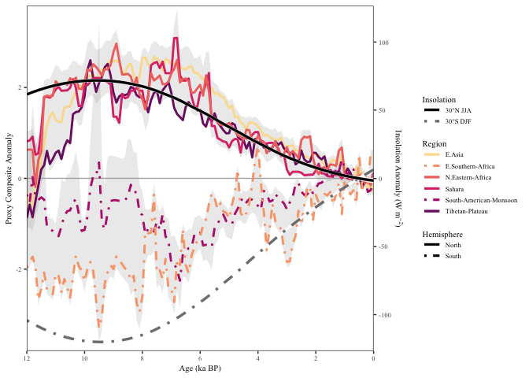
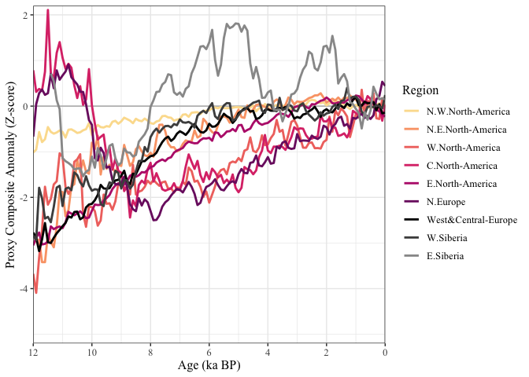

Fig3_Monsoon
================
Chris Hancock

``` r
library(cowplot)
library(egg)
library(geoChronR)
```

    ## Welcome to geoChronR version 1.1.9!

``` r
library(ggrepel)
library(ggplot2)
library(ggstar)
library(lipdR)
library(maptools)
library(proj4)
library(RColorBrewer)
library(reshape2)
library(rworldmap)
library(scales)
library(sp)
library(tidyverse)

print("Packages Loaded")
```

    ## [1] "Packages Loaded"

#### Load Insolation Data for 30N and 30S

``` r
insolationRaw    <- as.data.frame(read.table(file.path(wd,'Data','insolation_bein1.dat.txt')))
insolationRaw$V1 <- insolationRaw$V1*-1000 #covert from ka to yrs BP

insolation <- vector(mode='list')
for (lat in c(30,-30)){
  i <- as.character(lat)
  insolation[[i]] <- insolationRaw[which(insolationRaw$V2==lat),]
  #Calc seasonal values
  insolation[[i]] <-  data.frame(age=insolation[[i]]$V1,
                           DJF=apply(insolation[[i]][c(1,2,12)+2],1,sum),
                           JJA=apply(insolation[[i]][c(6,7,8)+2],1,sum),
                           ANN=apply(insolation[[i]][seq(1,12)+2],1,sum))[1:13,]
  #Calc anomalies
  for (col in 2:ncol(insolation[[i]])){
    insolation[[i]][,col] <- insolation[[i]][,col] - mean(insolation[[i]][1:2,col] )
  }
}
```

#### Load Proxy Data

``` r
var <- 'HC'
RegionTS <- read.csv(file.path(wd,'Data','RegionComposites',var,'MedianTS_byRegion.csv'))
for (i in 2:ncol(RegionTS)){
  RegionTS[,i] <- (RegionTS[,i] - mean(RegionTS[1:10,i],na.rm=TRUE))#/sd(RegionTS[,i],na.rm=TRUE) 
}

#Definite regions
NHmonsoon <- RegionTS[,c('time','EAS','TIB','SAH','NEAF')]#,'ECA','WCA')]
SHmonsoon <- RegionTS[,c('time','SAM','ESAF')]

NHmidlat <-  RegionTS[,c('time','NWN','NEN','WNA','CNA','ENA','NEU','WCE','WSB','ESB')]
SHmidlat <-  RegionTS[,c('time','NZ','SAU','SSA')]

load(url('https://github.com/SantanderMetGroup/ATLAS/blob/main/reference-regions/IPCC-WGI-reference-regions-v4_R.rda?raw=true'), verbose = TRUE)
```

    ## Loading objects:
    ##   IPCC_WGI_reference_regions_v4

\####Plot settings

``` r
scale <- 0.03 #For having 2 y-axis (what to multiply by)
shift <- 0    #For having 2 y-axis (what to add by)
s<-1          #linewidth
z <- 0.1 #which quantiles to plot (0.1 = 0.1 to 0.9)

save     <- TRUE

if (save){ print(paste0("save ",var," figs"))
} else{    print(paste0("plot ",var," figs"))}
```

    ## [1] "save HC figs"

``` r
figFont <- 'Times New Roman'
figText <- 10
figSize <- c(6.5,3)
```

#### Plot Monsson

``` r
ensNH <- read.csv(file.path(wd,'Data','RegionComposites',var,paste0(names(NHmonsoon)[2],'.csv')))
ensSH <- read.csv(file.path(wd,'Data','RegionComposites',var,paste0(names(SHmonsoon)[2],'.csv')))
#Get NH Data
for (reg in c(names(NHmonsoon)[-c(1:2)])){ensNH <- cbind(ensNH,read.csv(file.path(wd,'Data','RegionComposites',var,paste0(reg,'.csv')))) }
for (reg in c(names(SHmonsoon)[-c(1:2)])){ensSH <- cbind(ensSH,read.csv(file.path(wd,'Data','RegionComposites',var,paste0(reg,'.csv')))) }
#Subtract 0-1 ka mean
for (i in 1:ncol(ensNH)){ensNH[,i] <- (ensNH[,i] - mean(ensNH[1:10,i],na.rm=TRUE))}#/sd(RegionTS[,i],na.rm=TRUE) 
for (i in 1:ncol(ensSH)){ensSH[,i] <- (ensSH[,i] - mean(ensSH[1:10,i],na.rm=TRUE)) }#/sd(RegionTS[,i],na.rm=TRUE)

#Rename
NHmonsoon2 <- NHmonsoon
SHmonsoon2 <- SHmonsoon
for (reg in names(NHmonsoon2)[-1]){names(NHmonsoon2)[which(names(NHmonsoon2)==reg)] <- as.character(IPCC_WGI_reference_regions_v4[IPCC_WGI_reference_regions_v4@data$Acronym == reg, ]$Name)}
for (reg in names(SHmonsoon2)[-1]){names(SHmonsoon2)[which(names(SHmonsoon2)==reg)] <- as.character(IPCC_WGI_reference_regions_v4[IPCC_WGI_reference_regions_v4@data$Acronym == reg, ]$Name)}
 
plt <-ggplot()+
   geom_hline(yintercept =0,color='grey70') +
   geom_ribbon(aes(x=RegionTS$time,ymin=apply(ensNH,1,quantile,probs=(0+z),na.rm=TRUE),
                                   ymax=apply(ensNH,1,quantile,probs=(1-z),na.rm=TRUE)),
               fill='grey70',color=NA,alpha=0.25)+
   geom_ribbon(aes(x=RegionTS$time,ymin=apply(ensSH,1,quantile,probs=(0+z),na.rm=TRUE),
                                   ymax=apply(ensSH,1,quantile,probs=(1-z),na.rm=TRUE)),
               fill='grey70',color=NA,alpha=0.25)+
   geom_line(data=melt(NHmonsoon2,  id.vars = 'time', variable.name = 'region'),
                       aes(x=time,y=value,color=region,linetype='North'),size=s)+
   geom_line(data=melt(SHmonsoon2,  id.vars = 'time', variable.name = 'region'),
                       aes(x=time,y=value,color=region,linetype='South'),size=s)+
   geom_smooth(data=insolation[['30']],aes( x=age,y=(DJF)*scale+shift,
                                            fill="30\u00B0S DJF"),alpha=1,color="Grey50",linetype=4,size=s+0.2) +
   geom_smooth(data=insolation[['-30']],aes(x=age,y=(JJA)*scale+shift,
                                            fill="30\u00B0N JJA"),alpha=1,color="Black",linetype=1,size=s+0.2)+
   scale_x_reverse(limits = c(30000,0),breaks = seq(0, 12000, 2000),labels=seq(0, 12, 2),name="Age (ka BP)") +
   scale_y_continuous(limits=c(-100,100),name="Proxy Composite Anomaly",sec.axis = sec_axis((~./scale),name=bquote('Insolation Anomaly (W m'^-2*")"))) + 
   coord_cartesian(xlim=c(12000,0), ylim=c(-3.8,3.8),expand =FALSE)+
   #
   scale_linetype_manual(values=c(1,4,1,1,1,1,4,1,1,4),name='Hemisphere') +
   scale_fill_manual(values=c("White","White",rep(NA,8)),name='Insolation') +
   scale_color_manual(values=c('#fcde9c','#faa476','#f0746e','#dc3977','#b9257a','#7c1d6f','black','grey'),name='Region') +
   #
   guides(fill  = guide_legend(override.aes = list(linetype = c(1,4),color=c('Black','Grey50'))),
          color = guide_legend(override.aes = list(linetype = c(1,4,1,1,4,1))),
          linetype = guide_legend(override.aes = list(linetype = c(1,4))))+
   theme_bw() + 
   theme(legend.key = element_rect(fill=NA,color = "white"),
         legend.key.height =  unit(0.15, 'in'),
         legend.key.width = unit(0.25, 'in'),
         legend.spacing.y = unit(0.02, 'in'),
         panel.grid = element_blank(),
         text = element_text(family=figFont,size=8))
 
if (save){
   ggsave(plot=plt, width = 5.25, height = 3, dpi = 600,
        filename = file.path(wd,'Figures','RegionComposites',paste('Monsoon_',var,'.png',sep='')))
}
```

    ## `geom_smooth()` using method = 'loess' and formula 'y ~ x'
    ## `geom_smooth()` using method = 'loess' and formula 'y ~ x'

    ## Warning: Removed 5 row(s) containing missing values (geom_path).

``` r
plt
```

    ## `geom_smooth()` using method = 'loess' and formula 'y ~ x'
    ## `geom_smooth()` using method = 'loess' and formula 'y ~ x'

    ## Warning: Removed 5 row(s) containing missing values (geom_path).

<!-- -->

``` r
NHmidlat2 <- NHmidlat
SHmidlat2 <- SHmidlat

for (reg in names(NHmidlat2)[-1]){
   names(NHmidlat2)[which(names(NHmidlat2)==reg)] <- as.character(IPCC_WGI_reference_regions_v4[IPCC_WGI_reference_regions_v4@data$Acronym == reg, ]$Name)
}
 
for (reg in names(SHmidlat2)[-1]){
  names(SHmidlat2)[which(names(SHmidlat2)==reg)] <- as.character(IPCC_WGI_reference_regions_v4[IPCC_WGI_reference_regions_v4@data$Acronym == reg, ]$Name)
}

pltColors <- c('#fcde9c','#faa476','#f0746e','#dc3977','#b9257a','#7c1d6f','black','grey30','grey60')

plt <-ggplot()+
   geom_hline(yintercept =0,color='grey70') +
   geom_line(data=melt(NHmidlat2,  id.vars = 'time', variable.name = 'region'),
                       aes(x=time,y=value,color=region),size=s)+
   scale_x_reverse(limits = c(30000,0),breaks = seq(0, 12000, 2000),labels=seq(0, 12, 2),name="Age (ka BP)") +
   scale_y_continuous(limits=c(-100,100),name="Proxy Composite Anomaly (Z-score)") + 
   scale_color_manual(values=pltColors,name='Region') +
   coord_cartesian(xlim=c(12000,0), ylim=c(-5.2,2.2),expand =FALSE)+
   theme_bw() +  
   theme(text = element_text(family=figFont,size=12))


plt
```

<!-- -->
