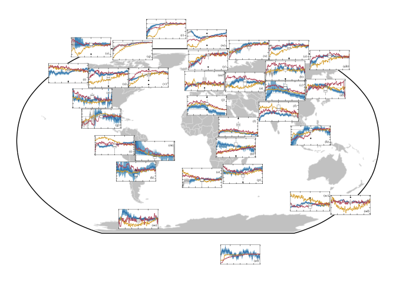
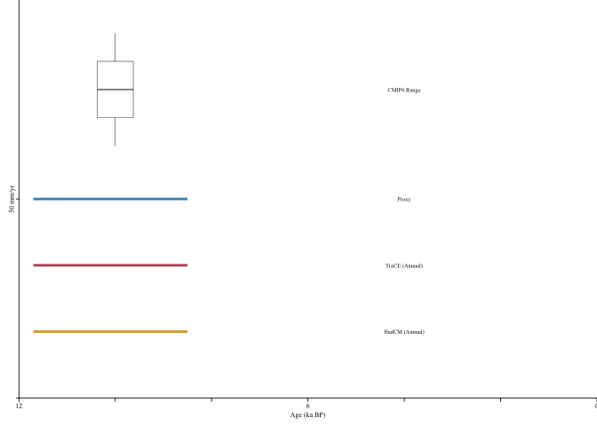

Figures 6 - Holocene Hydroclimate Proxy Composites (map)
================
Chris Hancock

#### Load Packages

``` r
library(cowplot)
library(egg)
library(geoChronR)
```

    ## Welcome to geoChronR version 1.1.9!

``` r
library(ggrepel)
library(ggplot2)
library(ggstar)
library(lipdR)
library(maptools)
library(proj4)
library(RColorBrewer)
library(rworldmap)
library(scales)
library(sp)
library(tidyverse)

print("Packages Loaded")
```

    ## [1] "Packages Loaded"

#### Load Data

``` r
var      <- 'HC'
modelVar <- 'pre_ANN'

lipdTSO <- readRDS(file.path(wd,'Data','Proxy','lipdData.rds'))[[var]]
proxyDf <- read.csv(file=file.path(wd,'Data','Proxy',paste0('proxyMetaData_',var,'.csv')))
proxyDf <- proxyDf %>% filter(season %in% c("Winter+","Summer+") == FALSE)
print("Proxy data loaded ")
```

    ## [1] "Proxy data loaded "

``` r
#Get x axis 
binvec <- read.csv(file.path(wd,'Data','RegionComposites',var,'MedianTS_byRegion.csv'))$time

#Load IPCC region data
load(url('https://github.com/SantanderMetGroup/ATLAS/blob/main/reference-regions/IPCC-WGI-reference-regions-v4_R.rda?raw=true'), verbose = TRUE)
```

    ## Loading objects:
    ##   IPCC_WGI_reference_regions_v4

``` r
regionData <- vector(mode='list')

for (reg in sort(unique(proxyDf$ipccReg))){
  regionData[[reg]]$polygon   <- IPCC_WGI_reference_regions_v4[IPCC_WGI_reference_regions_v4@data$Acronym == reg, ]
  regionData[[reg]]$name      <- as.character(regionData[[reg]]$polygon$Name)
  regionData[[reg]]$type      <- as.character(regionData[[reg]]$polygon$Type)
  regionData[[reg]]$latitude  <- regionData[[reg]]$polygon@polygons[[1]]@labpt[[1]]
  regionData[[reg]]$longitude <- regionData[[reg]]$polygon@polygons[[1]]@labpt[[2]]
  regionData[[reg]]$LiPD      <- lipdTSO[which(pullTsVariable(lipdTSO,'geo_ipccRegion')==reg)]
  regionData[[reg]]$LiPD      <- regionData[[reg]]$LiPD[which(pullTsVariable(regionData[[reg]]$LiPD,'climateInterpretation1_seasonalityGeneral') %in% c("Winter+","Summer+") == FALSE)]
  regionData[[reg]]$nproxy    <- length(regionData[[reg]]$LiPD)
  regionData[[reg]]$SummaryDF <- proxyDf %>% filter(ipccReg==reg)
  #ID times during region with <50% proxy availability
  regionData[[reg]]$pltTime   <- plotTimeAvailabilityTs(regionData[[reg]]$LiPD,age.range=c(0,12000),
                                                        group.var ='CategorySpecific',step=100)
  limits <- regionData[[reg]]$pltTime$dat %>% group_by(yvec) %>% summarise(pct=round(100*sum(value)/regionData[[reg]]$nproxy,1))
  regionData[[reg]]$Limits50  <- seq(max(0,which(limits$yvec<6000 & limits$pct < 50)+1),
                                     min(nrow(limits),which(limits$yvec>6000 & limits$pct < 50)-1))
  tryCatch(
    expr = {regionData[[reg]]$compEnsemble <- read.csv(file.path(wd,'Data','RegionComposites',var,paste(reg,'.csv',sep='')))},
    error = function(e){regionData[[reg]]$compEnsemble <- NA}
  )
}
```

#### Figure Settings

``` r
save     <- TRUE
specific <- TRUE 

if (save){ print(paste0("save ",var," figs"))
} else{    print(paste0("plot ",var," figs"))}
```

    ## [1] "save HC figs"

``` r
figFont <- 'Times New Roman'
figText <- 10
figSize <- c(6.5,7)
alph    <- 1
```

\####Plot Map

``` r
#Load Data----

if (var == 'T'){geo <-'all'
} else{geo<-'land'}

Data<-vector(mode='list')
Data$proxy <- read.csv(file.path(wd,'Data','RegionComposites',var,'MedianTS_byRegion.csv'))
if (!is.na(modelVar)){
  for (model in c('trace','hadcm','cmip6')){
    Data[[model]]<- read.csv(file.path(wd,'Data','Model','RegionalTS',
                                       paste('regional_',modelVar,'_',model,'_',geo,'.csv',sep='')))
  }
}

#Names----
page1<- c('WCA','ECA','TIB','EAS','NCA','SAS','SCA','SEA',
          'NWS','SAH','SAM','NEAF','NES','SEAF','WSAF','ESAF')
page2<- c('NEN','GIC','NWN','WNA','CNA','ENA','NEU','WSB',
          'WCE','ESB','MED','RFE','SAU','NZ','SSA','EAN')
if (var == "HC"){
  regions <- c(page1,page2)
  postion <- c(letters,"aa","ab","ac","ad","ae","af")
}
regNames <-names(Data$proxy)[-1]

#Plot---- 
xSize <- 0.1
ySize <- 0.07
map<-ggdraw(basemapPrj)
for (reg in regNames){ 
  #Load Data for Region
  regTso   <- regionData[[reg]]$LiPD
  regionDf <- regionData[[reg]]$SummaryDF
  #Ensemble Composite Values
  regEnsNA <- regionData[[reg]]$compEnsemble
  #Model Data
  scaleVal <- 1
  if (var == 'HC'){scaleVal <- 365}
  if (!is.na(modelVar)){
    hadcmVals <- (Data[['hadcm']][[reg]]-mean(Data[['hadcm']][1:10,reg],na.rm=TRUE))[1:121]*scaleVal
    traceVals <- (Data[['trace']][[reg]]-mean(Data[['trace']][1:10,reg],na.rm=TRUE))[1:121]*scaleVal
    cmip6Vals <- Data[['cmip6']][[reg]]*scaleVal
  }
  #Standardize mean at 0
  #regEnsNA <- as.matrix(regEnsNA - as.numeric(apply(regEnsNA[which(between(binvec,0,1000)),],2,mean,na.rm=TRUE)))
  #Standardize variance to match model
  if (var == 'HC'){
    regEnsNA <- regEnsNA / as.numeric(apply(regEnsNA,2,sd,na.rm=TRUE))
    if (!is.na(modelVar)){regEnsNA <- regEnsNA * mean(sd(traceVals,na.rm=TRUE),sd(hadcmVals,na.rm=TRUE))}
  }
  #
  regEns  <- matrix(NA,nrow(regEnsNA),ncol(regEnsNA))
  regEns[regionData[[reg]]$Limits50,] <- as.matrix(regEnsNA[regionData[[reg]]$Limits50 ,])
  #Set up plot
  regPlt <- ggdraw(ggplot()+theme_void()+theme(plot.background= element_rect(colour='White',fill='White')))
  ###Plot timeseries for region
  compBands <- vector(mode = 'list')
  compBands$na <-  plotTimeseriesEnsRibbons(X=binvec, Y=as.matrix(regEnsNA), alp=alph,line.width=0.1,
                                              color.low='grey95',
                                              color.high='grey80',
                                              color.line='grey40')
  compBands$ts <- plotTimeseriesEnsRibbons(X=binvec, Y=regEns, alp=alph-0.2,line.width=0.1,
                                             color.low=Csettings[1],
                                             color.high=Csettings[2],
                                             color.line=Csettings[3])
  #
  if (!is.na(modelVar)){
    plotlimit_set <- range(c(traceVals,hadcmVals,cmip6Vals,
                             apply(regEns,1,median,na.rm=TRUE),#+apply(regEns,1,sd,na.rm=TRUE)/2,
                             apply(regEns,1,median,na.rm=TRUE)#-apply(regEns,1,sd,na.rm=TRUE)/2
                             ),na.rm=TRUE) 
    plotlimit_set<- plotlimit_set+diff(range(plotlimit_set))*0.1*c(-1,1)
    #Plot Model Data
    compBands$ts <- compBands$ts + geom_hline(yintercept=0,size=0.05,color='black') +
      geom_line(aes(x=binvec[which(between(binvec,0,12000))],y=hadcmVals),color=Chadcm,size=0.3,alpha=alph)+
      geom_line(aes(x=binvec[which(between(binvec,0,12000))],y=traceVals),color=Ctrace,size=0.3,alpha=alph)+
      geom_boxplot(aes(x=6000,y=cmip6Vals),width=1000,size=0.1,alpha=alph,
                   outlier.size=0.5,outlier.stroke = 0.15,outlier.alpha=1,outlier.colour='Black')
  } else{
    plotlimit_set <- quantile(regEns,c(0.001,0.999),na.rm=TRUE)
    plotlimit_set<- plotlimit_set+diff(range(plotlimit_set))*0.1*c(-1,1)
  }
  if (var == 'HC'){b<-50}else if(var == 'T'){b<-1}
  for (plt in names(compBands)){
    compBands[[plt]] <- compBands[[plt]] + 
      scale_x_reverse(limits=c(12100,-100), expand=c(0,0), n.breaks=7,sec.axis = dup_axis())+ 
      scale_y_continuous(limits=c(-100000,100000),breaks=seq(-1000,2000,b),sec.axis = dup_axis())+
      coord_cartesian(xlim=c(12000,0), ylim=c(plotlimit_set),expand =FALSE) +
      theme_void() +
      theme(panel.border    = element_rect(color='Black',fill=NA,size=0.14),
            axis.ticks      = element_line(color='Black',size=0.1), 
            axis.ticks.length = unit(-1.5,"pt"),
            plot.margin       = unit(c(0, 0, 0, 0), "in"), legend.position='none')
    if (plt == "ts" & var == "HC"){
      if (abs(plotlimit_set)[1] < abs(plotlimit_set)[2]){
        yval=plotlimit_set[2]-diff(range(plotlimit_set))/5
      } else{
        yval=plotlimit_set[1]+diff(range(plotlimit_set))/5
      }
      compBands$ts <- compBands$ts +  
        geom_label(aes(x = 1100, y = yval,
                       label = paste("(",postion[which(regions==reg)],")",sep="")), 
                   fill = "white",family=figFont,size = 1.5,label.padding = unit(0.05, "lines"),
                   alpha = 0.75,label.size=NA)
    } 
    regPlt <- regPlt + draw_plot(compBands[[plt]], x = 0, y = 0, width = 1, height = 1)
  }
  plotLat <- refregionsPrj[refregions@data$Acronym == reg,]@polygons[[1]]@labpt[[1]]
  plotLon <- refregionsPrj[refregions@data$Acronym == reg,]@polygons[[1]]@labpt[[2]]
  if (is.null(regionData[[reg]]$xadjust)){regionData[[reg]]$xadjust <- 0}
  if (is.null(regionData[[reg]]$yadjust)){regionData[[reg]]$yadjust <- 0}
  map <- map + draw_plot(regPlt,width = xSize, height = ySize,
                         x = regionData[[reg]]$xadjust+(0.5-xSize/2)+0.5*plotLat/(9050504*2), 
                         y = regionData[[reg]]$yadjust+(0.5-ySize/2)+0.92*plotLon/(8625155*2), 
                         )
}

map
```

<!-- -->

``` r
if (var == 'HC'){
  ticklabel <- paste0(b,' mm/yr')
}else if(var == 'T'){
  ticklabel<-paste0(b,'\u00B0C')}

labelVar <- toupper(substr(modelVar,5,7))

if (labelVar == 'ANN'){labelVar<-'Annual'}
  
scale <- ggplot() +
  scale_x_reverse('Age (ka BP)',limits=c(12,0),expand=c(0,0),breaks=seq(0,12,2),labels=c('0','','','6','','','12'))+
  #geom_segment(aes(x=11.5,xend=6,y=1,yend=1),size=2,color='Black') +
  #geom_segment(aes(x=11.5,xend=6,y=2,yend=2),size=2,color='Black') +
  #geom_segment(aes(x=11.5,xend=6,y=3,yend=3),size=2,color='Black') +
  geom_segment(aes(x=11.7,xend=8.5,y=1,yend=1),size=1,color=Chadcm,alpha=alph) +
  geom_segment(aes(x=11.7,xend=8.5,y=2,yend=2),size=1,color=Ctrace,alpha=alph) +
  geom_segment(aes(x=11.7,xend=8.5,y=3,yend=3),size=1,color=Csettings[2],alpha=alph) +
  annotate("text",label=paste("HadCM (",labelVar,")",sep=""), x = 4, y = 1,family=figFont,color='Black',size = 1.7)+
  geom_boxplot(aes(x=10,y=seq(38,55,1)/10,width=4),size=0.2,alpha=alph,
                            outlier.size=0.01,outlier.stroke = 0.05,outlier.alpha=1,outlier.colour='Black')+
  annotate("text",label=paste("TraCE (",labelVar,")",sep=""), x = 4, y = 2,family=figFont,color='Black',size = 1.7) + 
  annotate("text",label="Proxy", x = 4, y = 3,family=figFont,color='Black',size = 1.7) + 
  annotate("text",label="CMIP6 Range", x = 4, y = 4.65,family=figFont,color='Black',size = 1.7) + 
  scale_y_continuous(ticklabel,limits=c(0,6),expand=c(0,0),breaks=c(0,3),labels=c(' ',' '))+
  theme_void()+ 
  theme(panel.background=element_rect(colour='White',fill='White'),
        plot.background    =element_rect(colour=NA,fill=NA),
        axis.line.x = element_line(color = 'black',size=0.3),
        axis.ticks  = element_line(color = 'Black',size=0.3),
        axis.line.y.left=element_line(color = 'Black',size=0.3), 
        axis.text = element_text(family=figFont,size=6,margin = margin(t = 1, r = 0, b = 2, l = 0)),
        axis.title.x = element_text(family=figFont,size=6, margin(t = 1, r = 0, b = 2, l = 0)),
        axis.title.y = element_text(family=figFont,size=6, angle=90,margin(t = 1, r = 5, b = 5, l = 1)),
        axis.ticks.length.x=unit(3,"pt"),
        axis.ticks.length.y=unit(2,"pt"),
        legend.position='None',
        plot.margin = unit(c(0, 0, 0.1,0.1), "in"))
```

    ## Warning: Ignoring unknown aesthetics: width

    ## Warning: Vectorized input to `element_text()` is not officially supported.
    ## Results may be unexpected or may change in future versions of ggplot2.
    ## Vectorized input to `element_text()` is not officially supported.
    ## Results may be unexpected or may change in future versions of ggplot2.

``` r
        #text = element_text(family=figFont,size=6))


scale
```

<!-- -->

``` r
if (var == 'HC'){
  map2 <- map +
    theme(plot.margin = unit(c(0,rep(0,4)), "in"))#+
    #annotate("text",label=paste("(a) Hydroclimate (",toupper(substr(modelVar,1,3)),")",sep=""), x = 0.11, y = 0.93,family=figFont,color='Black',size = 2)
} else{
  map2 <- map +
    theme(plot.margin = unit(c(0,rep(0,4)), "in"))#+map2 <- map +annotate("text",label="(b) Temperature", x = 0.11, y = 0.93,family=figFont,color='Black',size = 2.2)
  
}
map3 <- map2 + draw_plot(scale,
                        x = 0.09, 
                        y = 0.16, 
                        width = xSize*1.5, height = ySize*3.4)
```

    ## Warning in grid.Call(C_stringMetric, as.graphicsAnnot(x$label)): font family
    ## 'Times New Roman' not found in PostScript font database

    ## Warning in grid.Call(C_stringMetric, as.graphicsAnnot(x$label)): font family
    ## 'Times New Roman' not found in PostScript font database

    ## Warning in grid.Call(C_stringMetric, as.graphicsAnnot(x$label)): font family
    ## 'Times New Roman' not found in PostScript font database

    ## Warning in grid.Call(C_stringMetric, as.graphicsAnnot(x$label)): font family
    ## 'Times New Roman' not found in PostScript font database

    ## Warning in grid.Call(C_stringMetric, as.graphicsAnnot(x$label)): font family
    ## 'Times New Roman' not found in PostScript font database

    ## Warning in grid.Call(C_stringMetric, as.graphicsAnnot(x$label)): font family
    ## 'Times New Roman' not found in PostScript font database

    ## Warning in grid.Call(C_stringMetric, as.graphicsAnnot(x$label)): font family
    ## 'Times New Roman' not found in PostScript font database

    ## Warning in grid.Call(C_stringMetric, as.graphicsAnnot(x$label)): font family
    ## 'Times New Roman' not found in PostScript font database

    ## Warning in grid.Call(C_stringMetric, as.graphicsAnnot(x$label)): font family
    ## 'Times New Roman' not found in PostScript font database

    ## Warning in grid.Call(C_stringMetric, as.graphicsAnnot(x$label)): font family
    ## 'Times New Roman' not found in PostScript font database

    ## Warning in grid.Call(C_stringMetric, as.graphicsAnnot(x$label)): font family
    ## 'Times New Roman' not found in PostScript font database

    ## Warning in grid.Call(C_stringMetric, as.graphicsAnnot(x$label)): font family
    ## 'Times New Roman' not found in PostScript font database

    ## Warning in grid.Call(C_stringMetric, as.graphicsAnnot(x$label)): font family
    ## 'Times New Roman' not found in PostScript font database

    ## Warning in grid.Call(C_stringMetric, as.graphicsAnnot(x$label)): font family
    ## 'Times New Roman' not found in PostScript font database

``` r
if (save) {
  ggsave(plot=map3, width = 6.5, height = 3.38, dpi = 400,
         filename = paste0(file.path(wd,'Figures','RegionComposites','GlobalTSmap','global_'),
                           modelVar,'_compBandPlt.png'))
}
```
