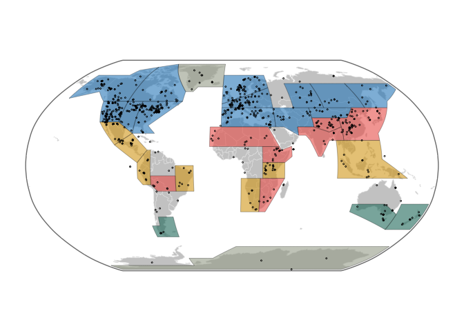
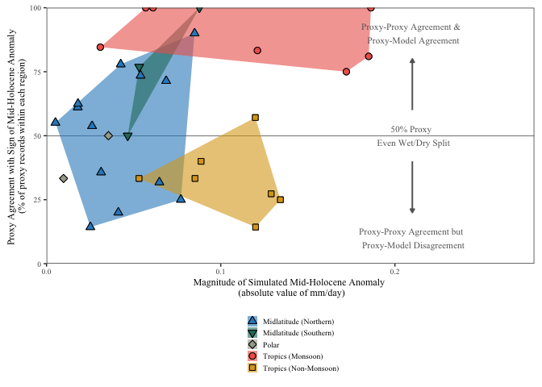
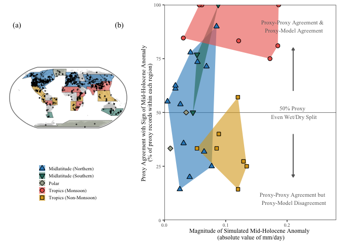

Figure 9 - Agreement for sign of mid-Holocene Hydroclimate Anomalies -
Scatter
================
Chris Hancock

#### Load Packages

``` r
library(cowplot)
library(egg)
library(geoChronR)
```

    ## Welcome to geoChronR version 1.1.9!

``` r
library(ggrepel)
library(ggplot2)
library(ggstar)
library(lipdR)
library(maptools)
library(proj4)
library(RColorBrewer)
library(rworldmap)
library(scales)
library(sp)
library(tidyverse)

print("Packages Loaded")
```

    ## [1] "Packages Loaded"

#### Load Data

``` r
var     <- 'HC'
lipdTSO <- readRDS(file.path(wd,'Data','Proxy','lipdData.rds'))[[var]]
proxyDf <- read.csv(file=file.path(wd,'Data','Proxy',paste0('proxyMetaData_',var,'.csv')))
print("Proxy data loaded ")
```

    ## [1] "Proxy data loaded "

``` r
#Load IPCC region data
load(url('https://github.com/SantanderMetGroup/ATLAS/blob/main/reference-regions/IPCC-WGI-reference-regions-v4_R.rda?raw=true'), verbose = TRUE)
```

    ## Loading objects:
    ##   IPCC_WGI_reference_regions_v4

#### Figure Settings

``` r
save     <- TRUE
specific <- TRUE 

if (save){ print(paste0("save ",var," figs"))
} else{    print(paste0("plot ",var," figs"))}
```

    ## [1] "save HC figs"

``` r
figFont <- 'Times New Roman'
figText <- 10
figSize <- c(6.5,3)
```

#### Load Model Data

``` r
var <- 'pre'

modelTSpath <- file.path(wd,'Data','Model','RegionalTS')

#Load Data
proxyDataAgree    <- read.csv(file.path(wd,'Data','Proxy','proxyMetaData_HC.csv'))
proxyRegionTS     <- read.csv(file.path(wd,'Data','RegionComposites','HC','MedianTS_byRegion.csv'))
hadcmRegionTS_ann <- read.csv(file.path(modelTSpath,paste('regional_',var,'_ANN_hadcm_land.csv',sep='')))
traceRegionTS_ann <- read.csv(file.path(modelTSpath,paste('regional_',var,'_ANN_trace_land.csv',sep='')))
hadcmRegionTS_jja <- read.csv(file.path(modelTSpath,paste('regional_',var,'_JJA_hadcm_land.csv',sep='')))
traceRegionTS_jja <- read.csv(file.path(modelTSpath,paste('regional_',var,'_JJA_trace_land.csv',sep='')))
hadcmRegionTS_djf <- read.csv(file.path(modelTSpath,paste('regional_',var,'_DJF_hadcm_land.csv',sep='')))
traceRegionTS_djf <- read.csv(file.path(modelTSpath,paste('regional_',var,'_DJF_trace_land.csv',sep='')))

cmipRegionTS_ann <- read.csv(file.path(modelTSpath,paste('regional_',var,'_ANN_cmip6_land.csv',sep='')))
```

#### Calculate values

<!-- -->

<!-- -->

``` r
plt <- cowplot::ggdraw(ggplot() + 
                       coord_cartesian(xlim=c(0,1),ylim=c(0,1),expand=FALSE)+
                       annotate("text",label="(a)", x = 0.05, y = 0.9,family=figFont,color='black',size=4)+
                       annotate("text",label="(b)", x = 0.35, y = 0.9,family=figFont,color='black',size=4)+

                       theme_void()+
                       theme(plot.background= element_rect(colour='White',fill='White'),
                             panel.background = element_rect(colour='White',fill='White')))+
    draw_plot(ggpubr::as_ggplot(get_legend(scatter)),       x = 0,     y = 0, width = 0.4, height = 0.5)+
    draw_plot(scatter+theme(legend.position='None'),        x = 0.4,   y = 0, width = 0.6, height = 1)+
                        #annotate("text",label="EAS", x = 0.52, y = 0.85,family=figFont,color=monsoonC,size=3)+
                        #annotate("text",label="NWS", x = 0.68, y = 0.26,family=figFont,color=tropicC,size=3)+
                        #annotate("text",label="ESB", x = 0.54, y = 0.26,family=figFont,color=nml,size=3)+

  draw_plot(proxyMapRegions,  x = 0,   y = 0.25, width = 0.4, height = 0.7)


monsoonC<- '#ED645A'
tropicC <- '#DAA51B'
sml     <- '#24796C'
nml     <- '#2F8AC4'
polar   <- '#A5AA99'
  
plt
```

<!-- -->

``` r
if (save) {
  ggsave(plot=plt, width = 6.5, height = 3.25, dpi = 600,
         filename = file.path(wd,"Figures","Model",'ProxyAgreeByModelAnom.png'))
}
```
